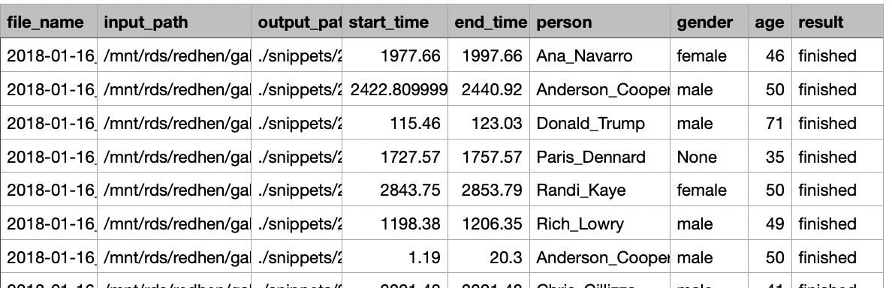
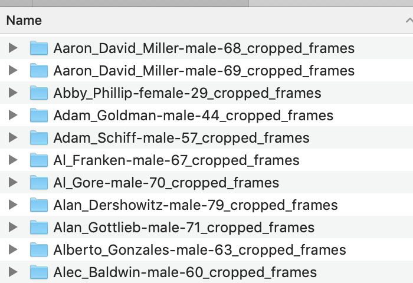
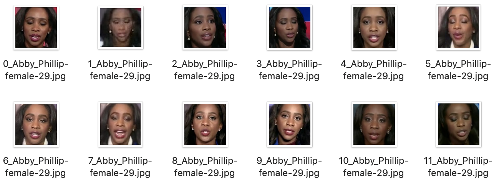

- [Summary of Phase 1&2:](#summary-of-phase-1&2)

- [Phase 3: Model Training and Prediction](#phase-3-model-training-and-prediction)
  * [Step1: Data Preprocessing](#data-preprocessing)

  * [Step2: Training](#training)

  * [Step3: Prediction](#prediction)


### Summary of Phase 1&2:

At the end of Phase 1, we got a csv file that contains all the information of file path, start and end times, speakers' name, age and gender, etc. 



In Phase 2, we utilized the Open Source tool to do face recognition, and face clustering. In the end, we got the images that can be used as input for CCN model. 





#### Phase 3: Model training and prediction

We use the Soft Stagewise Regression NN ([SSRNET](https://github.com/shamangary/SSR-Net/blob/master/ijcai18_ssrnet_pdfa_2b.pdf)) as our model.  It is a compact model (only 0.32 MB) and uses the Keras/TensorFlow framework. 

We revise their data preparation code to fit our cropped image (*news dataset*), 

`input`➔ `script` ➔ `output`

##### Data Preprocessing:

`news` (directory that contains the output from Phase 2 ) ➔  `TYY_NEWS_create_db.py` ➔  `news.npz` 

```
cd model
$ . run_data.sh
```

##### Training:

 `news.npz` ➔  `SSRNET_train_age.py` ➔ `ssrnet_3_3_3_64_0.25_0.25.h5`

 `news.npz` ➔  `SSRNET_train_age.py` ➔ `ssrnet_3_3_3_64_0.25_0.25.h5`

```
cd train
$ . run_ssrnet_age.sh
$ . run_ssrnet_gender.sh
cd ..
cp train/news_age_models/ssrnet_3_3_3_64_0.25_0.25/ssrnet_3_3_3_64_0.25_0.25.h5 pred/SSRNET/ssrnet_age_3_3_3_64_0.25_0.25.h5
cp train/news_gender_models/ssrnet_3_3_3_64_0.25_0.25/ssrnet_3_3_3_64_0.25_0.25.h5 pred/SSRNET/ssrnet_gender_3_3_3_64_0.25_0.25.h5
```

##### Prediction:

`xx.mp4` ➔   `pred.py` ➔ `xx_out.mp4`

```
$ . run_pred.sh
```


